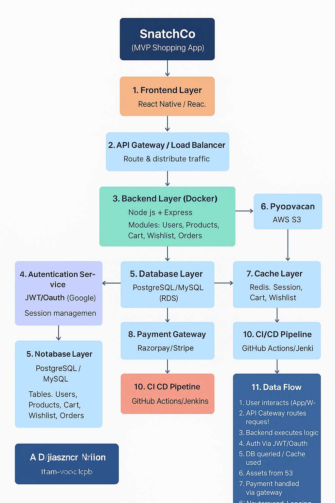

→ SnatchCo – Full Architecture & Workflow

This document provides a **full-fledged tree-style architecture and workflow** for SnatchCo, the MVP shopping application.

---

→→ **Components Description**

1. **Frontend (React Native / React.js)**
   - User interface for mobile and web.  
   - Handles user interactions and communicates with backend APIs.  

2. **API Gateway / Load Balancer**
   - AWS ALB for distributing traffic across multiple backend instances.  

3. **Backend API (Node.js + Express)**
   - Handles business logic, authentication, and API endpoints.  
   - Dockerized for portability.  

4. **Authentication Service**
   - JWT / OAuth for secure user login and session management.  

5. **Database Layer**
   - PostgreSQL / MySQL (AWS RDS) storing users, products, orders, cart, wishlist.  

6. **Object Storage**
   - AWS S3 for storing product images, banners, and static assets.  

7. **Cache Layer**
   - Redis for session storage, cart, and wishlist caching.  

8. **Payment Gateway**
   - Razorpay or Stripe integration for secure payments.  

9. **Monitoring & Logging**
   - Prometheus + Grafana + ELK stack for performance monitoring and logging.  

10. **CI/CD Pipeline**
    - GitHub Actions / Jenkins for automated build, test, and deployment.  

---

→→ **Data Flow**

1. User interacts with the frontend → sends requests to the API Gateway.  
2. Requests routed to backend APIs → business logic executed.  
3. Backend queries the database or cache → fetches/updates data.  
4. Payment requests handled via Payment Gateway.  
5. Monitoring & logging track all activities and errors.  
6. CI/CD pipeline ensures automated deployment and updates.
→ **SnatchCo Architecture Tree**

```


SnatchCo (MVP Shopping App)
│
├── 1. Frontend Layer (React Native / React.js)
│   ├─ Screens: Login/Signup, Profile, Catalog, Product Details
│   ├─ Components: Buttons, Cards, Forms, Modals
│   └─ Interactions: Calls Backend APIs via REST
│
├── 2. API Gateway / Load Balancer (AWS ALB)
│   ├─ Distributes traffic to backend instances
│   └─ Handles HTTPS termination & routing
│
├── 3. Backend Layer (Node.js + Express, Dockerized)
│   ├─ Modules
│   │   ├─ User Module
│   │   │   ├─ Signup / Login (JWT / OAuth)
│   │   │   └─ Profile Management
│   │   ├─ Product Module
│   │   │   ├─ CRUD Products
│   │   │   ├─ Search & Filter
│   │   │   └─ Category Management
│   │   ├─ Cart Module
│   │   │   ├─ Add / Remove Items
│   │   │   └─ View Cart
│   │   ├─ Wishlist Module
│   │   │   ├─ Add / Remove Items
│   │   │   └─ View Wishlist
│   │   ├─ Orders Module
│   │   │   ├─ Place Order
│   │   │   ├─ Order History
│   │   │   └─ Track Status
│   │   └─ Payment Module
│   │       ├─ Payment Integration (Razorpay / Stripe)
│   │       └─ Update Payment Status
│   └─ Dockerized for portability and CI/CD deployment
│
├── 4. Authentication Service
│   ├─ JWT / OAuth (Google)
│   └─ Session management via Redis
│
├── 5. Database Layer (PostgreSQL / MySQL on AWS RDS)
│   ├─ Users Table
│   ├─ Products Table
│   ├─ Cart Table
│   ├─ Wishlist Table
│   ├─ Orders Table
│   └─ Order Items Table
│
├── 6. Object Storage (AWS S3)
│   ├─ Product Images
│   ├─ Banners
│   └─ Other Static Assets
│
├── 7. Cache Layer (Redis)
│   ├─ Session Data
│   ├─ Cart Caching
│   └─ Wishlist Caching
│
├── 8. Payment Gateway
│   ├─ Razorpay / Stripe Integration
│   └─ Handles secure transactions
│
├── 9. Monitoring & Logging
│   ├─ Prometheus (Metrics)
│   ├─ Grafana (Dashboards)
│   └─ ELK Stack (Logs & Analytics)
│
├── 10. CI/CD Pipeline
│   ├─ GitHub Actions / Jenkins
│   ├─ Build → Test → Deploy
│   ├─ Auto-deploy backend & frontend to AWS EC2 / S3
│   └─ Rollback strategy in case of failures
│
└── 11. Data Flow (Stepwise)
1\. User interacts with frontend (App/Web)
2\. Request routed through API Gateway / Load Balancer
3\. Backend API executes business logic
4\. Authentication validated via JWT / OAuth
5\. Database queried (PostgreSQL/MySQL)
6\. Cache (Redis) used for sessions, cart, wishlist
7\. Object Storage (S3) serves images & assets
8\. Payment handled via Razorpay / Stripe
9\. Monitoring & logs tracked in Prometheus/Grafana/ELK
10\. CI/CD ensures smooth deployment & updates

```

---

snatchco/
├── backend/                 # Node.js + Express backend
│   ├── Dockerfile           # Docker instructions for backend
│   ├── package.json         # Backend dependencies & scripts
│   ├── package-lock.json    # Auto-generated (npm install)
│   ├── server.js            # Entry point for backend
│   ├── src/
│   │   ├── routes/
│   │   │   └── userRoutes.js     # Routes for user APIs
│   │   ├── controllers/
│   │   │   └── userController.js # Logic for handling user requests
│   │   ├── models/
│   │   │   └── userModel.js      # User DB schema (Postgres)
│   │   └── config/
│   │       └── db.js             # DB connection
│   └── .env                 # Environment variables
│
├── frontend/                # React frontend
│   ├── Dockerfile
│   ├── package.json
│   ├── public/
│   │   └── index.html
│   └── src/
│       ├── App.js
│       └── index.js
│
├── docker-compose.yml       # Run everything (frontend + backend + DB + Redis)
└── README.md


→ **Highlights & Notes**

- **Frontend:** Mobile-first design with reusable UI components.  
- **Backend:** Modular architecture, each module handles a specific responsibility.  
- **Database & Cache:** Structured storage with caching for performance.  
- **Payments:** Secure integration with Razorpay / Stripe.  
- **Monitoring:** Metrics, logs, and dashboards for production monitoring.  
- **CI/CD:** Automated pipeline ensures fast and safe deployments.  
- **Scalability:** Load balancer and Dockerized services enable horizontal scaling.  

