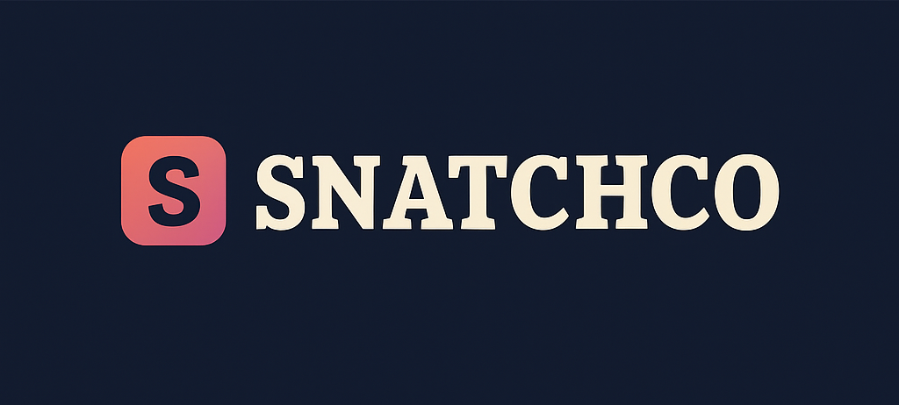
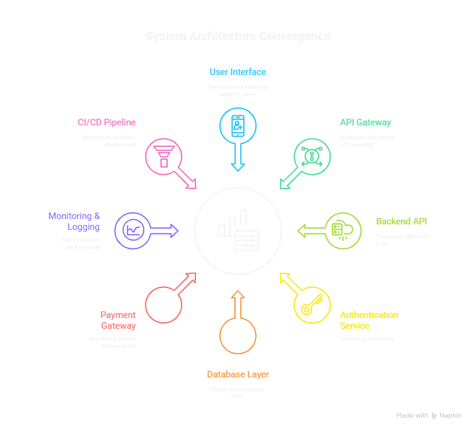

 SnatchCo – MVP Shopping App



SnatchCo is a Minimum Viable Product (MVP) shopping application for fashion e-commerce, inspired by Myntra.  
It includes user authentication, product catalog, cart, wishlist, checkout, and payment features. DevOps practices like CI/CD, Docker, and cloud deployment are integrated.

---

 1. App Overview
- Goal: Build a functional MVP shopping app for fashion e-commerce.  
- Target Platform: Mobile (Android/iOS) with React Native (optional web with React.js).  
- Project Duration: ~45 days  
- App Name: SnatchCo  

---

 2. MVP Features

 User Module
- Sign up / Login (Email, Google)  
- Profile management (Name, Email, Address, Mobile)  

 Product Module
- Product catalog (Men, Women, Kids)  
- Product details (images, price, size, description)  
- Search & filter by category, price, size  

 Cart & Wishlist
- Add/remove items  
- Save items to wishlist  

 Checkout & Payment
- Address selection  
- Order summary  
- Payment gateway integration (Razorpay / Stripe)  

 Orders
- Order history  
- Track order status (Placed → Shipped → Delivered)  

---

 3. Tech Stack

| Layer                | Tech / Tool |
|---------------------|------------|
| Frontend            | React Native (Mobile) / React.js (Web) |
| Backend             | Node.js + Express (Dockerized) |
| Database            | PostgreSQL / MySQL (AWS RDS) |
| Authentication      | JWT / OAuth (Google) |
| Payments            | Razorpay / Stripe |
| Cloud / Hosting     | AWS (EC2, S3, RDS) |
| CI/CD               | GitHub Actions / Jenkins |
| Caching             | Redis |
| Monitoring / Logs   | Prometheus + Grafana + ELK |
| UI/UX Design        | Figma / Adobe XD |

 


 5. 45-Day Development Timeline

| Day(s)       | Task / Module                                      |
|--------------|---------------------------------------------------|
| 1–2          | Database schema & planning                         |
| 3            | GitHub repo setup                                  |
| 4            | Frontend project setup                              |
| 5            | Database setup (AWS RDS / local)                  |
| 6–7          | User Authentication (Backend)                     |
| 8–9          | Product APIs                                      |
| 10–11        | Cart APIs                                         |
| 12           | Wishlist API                                      |
| 13–14        | Orders API                                        |
| 15–17        | Payment Gateway Integration                        |
| 18–20        | Frontend – User Auth Screens                        |
| 21–23        | Frontend – Product Catalog & Details               |
| 24–26        | Frontend – Cart & Wishlist Screens                 |
| 27–29        | Frontend – Checkout & Payment Screens              |
| 30–32        | Frontend – Order History Screen                     |
| 33–35        | Backend Testing                                   |
| 36–38        | Frontend Integration Testing                        |
| 39–40        | Bug Fixing & Optimization                           |
| 41–42        | AWS Deployment – Backend & DB                       |
| 43           | Frontend Deployment                                 |
| 44           | CI/CD Pipeline Setup                                 |
| 45           | Beta Launch & Review                                 |

---

 6. Future Enhancements
- Push notifications (offers, order updates)  
- AI-based product recommendations  
- Coupons & loyalty programs  
- AR/VR try-on features  
- Multi-language & multi-currency support  

---

 7. How to Run Locally

```bash
 Clone the repo
git clone https://github.com/yourusername/snatchco.git

 Backend
cd backend
npm install
npm run dev

 Frontend
cd frontend
npm install
npm start

